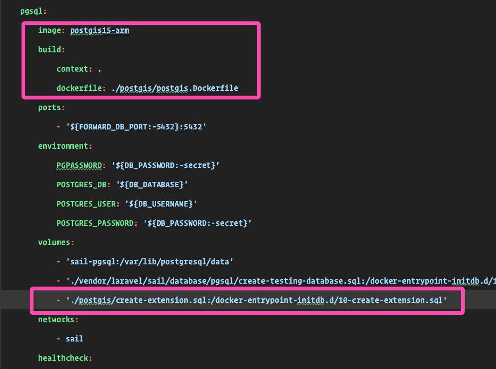

### Postgis in Laravel Sail

Follow these files, and you'll understand what has to be done in order to achieve this.

This is an implementation of the standalone compose-file repo [postgres-postgis-arm-docker](https://github.com/ijpatricio/postgres-postgis-arm-docker) in an actual application.
